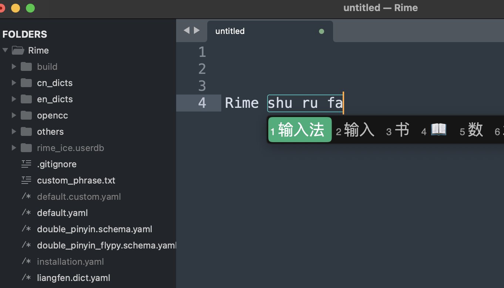
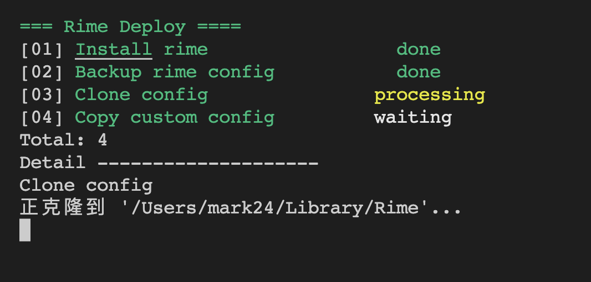

# Rime auto deploy

-- Rime输入法安装脚本，让一切更轻松

一个自用的脚本，帮助无痛快速安装、部署 Rime 输入法（中州韵、小狼毫，鼠须管）以及部署配置

* 集成 雾凇拼音配置，来源 https://dvel.me/posts/rime-ice/
* 支持 模糊拼音以及配置
* 集成 20款 输入法皮肤, 来源 https://ssnhd.com/2022/01/11/rime-skin/ 包括微信皮肤
* 新增主题。支持Linux、MacOS

---
QQ 交流群：

* 761103715

---

# 一、不同系统下使用说明

## 系统

⚠️ 支持：

* MacOS ✅
* Linux 发行版 ✅
* Windows ✅  [查看 Windows 下的说明文档](./WINDOWS_README.md)





## 依赖

安装 `Ruby 3`

* Mac OS `brew install ruby`
* Debian Linux distro `sudo apt install ruby`
* 其他 Linux 根据自己情况判断。有些 Linux 可能自带 Ruby

⚠️ MacOS脚本会自动帮助安装 Rime，Linux下由于发行版、Rime 衍生方式太多，需要自行提前安装 Rime

```
For Fcitx5, install fcitx5-rime.
For Fcitx, install fcitx-rime.
For IBus, install ibus-rime.

more: https://wiki.archlinux.org/title/Rime
```

## MacOS/Linux 使用方法


> Linux发行版和包管理太多，需要执行安装 Rime。MacOS 使用 brew 自动安装，需要拥有 brew


- step1: 克隆/下载 latest 最新的稳定版到本地
    - `git clone --depth=1 https://github.com/Mark24Code/rime-auto-deploy.git --branch latest`
- step2: 进入项目目录
    - `cd rime-auto-deploy`
- step3: 执行部署脚本
    - `./installer.rb`

## Windows 使用方法

[查看 Windows 下的说明文档](./WINDOWS_README.md)

# 二、工作模式说明

## 1. 自动模式 (Auto Mode)

适用于第一次安装输入法

```
- step01: 确认安装 Rime 输入法，自动安装
    - 需要用户自行登出，重进系统，设置Rime输入法为系统输入法
- step02: 备份 Rime 默认配置
- step03: 自动安装 Rime-ice 配置
- step04: 自动追加自定义配置模板
```

## 2. 手动模式 (Manual Mode)

手动模式可以自定义选择自动部署中 step 01~04 分别单独执行
适用于想要单独对步骤进行运行，比如获取最新的 雾凇拼音配置、调试更新修改自定义配置

⚠️ 提示

### 1. 如果您已经安装了Rime，想手动执行：使用最新版本的 雾凇拼音

为了避免直接执行 `03` 会造成目录冲突，这里建议先执行 `02` 进行配置备份，再手动执行 `03` 进行配置下载

> 备份文件并不会消失。而是会换个名字。放在同一个目录下。方便找回数据。如果觉得太冗余，可以手动删除历史备份的 `Rime.xxx.old` 的目录

### 2. 如果想进行自定义配置

- 配置文件放在 `custom/` 目录中。在 `04` 步执行之后，会复制进入 Rime 的配置目录

- 你可以把自己的配置放在  `custom/` 目录下一起被复制

- 你可以修改 `custom/` 目录下的配置。 参见 `三、自定义配置` 部分

- ⚠️  RIME 配置使用了 YAML 格式，对空格、缩进保持敏感，尽可能地对齐。 `#` 前缀表示这行配置不生效，去除则生效

- 配置文件可以对模糊拼音、皮肤、字体进行进一步的设置

- 编辑完成保存文件，再手动执行 `04` 单独更新配置

## 3. 升级模式（Upgrade Mode）

```
=== Rime Deploy ====
welcome to use Rime installer.

Choose mode:
[1] Auto mode: Suitable for first-time operation.
[2] Handle mode: Decide to execute on your own.
[3] Upgrade mode: Suitable for upgrade exist Rime  <---- 更新模式 v3.2.0 新增
Tips: input the index. e.g: 1; Ctrl-C exit.
```

升级模式用来解决，适用于第一次安装脚本之后，后续想单独的更新上游配置

```
[Upgrade Mode]

Choose mode:
[1] Upgrade rime auto deploy  <---- 更新这个脚本自己，仅限于 git 下载方式
[2] Upgrade rime config  <----  更新配置仓库，目前是 雾凇拼音，会升级到最新
Tips: input the index. e.g: 1; Ctrl-C exit.
```


# 三、自定义配置

## 1. 自定义模糊拼音

编辑 `custom/rime_ice.custom.yaml` 中模糊拼音定义部分

然后保存文件，重新执行脚本，进入手动模式，单独执行 step04，重新部署 Rime

## 2. 修改皮肤

* MacOS 修改 `squirrel.custom.yaml`
* Windows 修改 `weasel.custom.yaml`


```
style:
    color_scheme: <白天模式主题>
    color_scheme_dark: <黑夜模式主题>

# 皮肤列表
preset_color_schemes:
  macos_light: # <---  上面的主题，可以替换为下面的主题名字
    .....
```

然后保存文件，重新执行脚本，进入手动模式，单独执行 step04，重新部署 Rime

## 2.1 修改皮肤字体大小

找到上面正在使用的皮肤名称

```
font_point: 16 # <----  修改对应皮肤的 字体大小， 推荐范围 16~22
```

然后保存文件，重新执行脚本，进入手动模式，单独执行 step04，重新部署 Rime


# 四、参考 & 鸣谢


* 流程参考: Tiwtter @lewangdev
* 配置来源: https://github.com/iDvel/rime-ice


# 最后

到这里看来已经解决了您的问题。可以愉快的使用 Rime！让我们 🍻

后续，如果您遇到了使用问题，可以：

* [如果遇到了问题、建议 可以点击这段文字创建一个 Github Issue 给我，我会尽可能的答复](https://github.com/Mark24Code/rime-auto-deploy/issues/new)
* 发邮件给我 mark.zhangyoung@qq.com

----

如果您觉得帮到您了，节省了大量时间。可以请作者喝杯可乐~ 🥳

微信


支付宝


[](https://star-history.com/#Mark24Code/rime-auto-deploy&Date)
